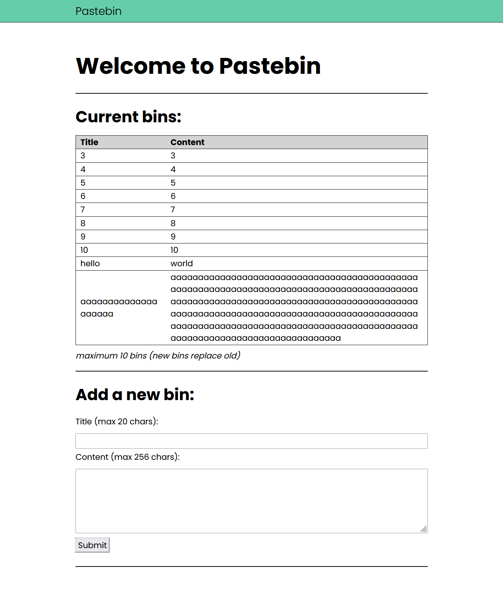

# Pastebin

Pastebin is a simple application written in Golang and designed for use with a
MongoDB backend. It is primarily a web application served over HTTP(S) but also
offers a gRPC endpoint and command-line client utility.



## Usage

From the root of the repository, run `docker-compose up`. This will:

- Build and start the mongo, client, and server containers
- The client container will compile the command-line utilities and save them to
  the `client/` sub-directory

To push the Pastebin server container to AWS ECR, run `terraform apply`.

## Dependencies

To build and run locally:

- docker
- docker-compose

To push to AWS ECR using the included `tf` file:

- terraform
- environment variables for:
  - `AWS_ACCESS_KEY_ID`
  - `AWS_SECRET_ACCESS_KEY`
  - `AWS_REGION`

Notably, using this repository does _not_ require the installation of the golang
toolchain. All compilation is performed in containers. 

## Project Components

### client

`client/` contains:

- the golang code for a gRPC-based command-line client for the Pastebin server
- a Makefile with instructions for building the client
- a Dockerfile
 
When the repository's `docker-compose.yaml` is used, the client Dockerfile
builds and starts a container that builds the command-line client and exits.

The command-line client is built for Linux and Windows. The binaries are saved
to the `client` sub-directory.

### db

`db/` contains the Dockerfile and Mongo init script (`init-mongo.js`) for a
local test instance of MongoDB. The Mongo image is NOT built and pushed to AWS 
by default. It is expected one would use a MongoDB server running on an EC2, or
perhaps a DocumentDB instance.

The local Mongo instance's data is not persisted in the default configuration.

### proto

`proto/` contains the protobuf definitions used by the server and client
binaries for gRPC communication.

### server

`server/` contains the static HTML, CSS, JS, and Golang source for the Pastebin
application, as well as a Dockerfile for building the application container.

The Pastebin web application provides API endpoints and a static, single-page
website with "dynamic" data sent to and retrieved from the APIs via JavaScript
functions.

The web application is available over HTTPS. Encryption is provided with
self-signed certificates that are generated when the container is built. 

The server also listens for HTTP connections on port 80 and redirects all
requests to HTTPS.

The previously mentioned APIs are also available over gRPC on port 50051.
Those connections are encrypted with the same self-signed certificates. 

The command-line client is the primary way to interact with the gRPC APIs (see
above).

The server binary uses environment variables for runtime connection. See the
docker-compose file for an example.

#### Required ENV Variables

`DB_CONN_STRING` tells the application how to connect to its backend. It will
likely contain credentials, and should be treated as a secret.

#### Optional ENV Variables

`DISABLE_HTML_ESCAPE`: By default, the application performs input sanitation on
user-submitted data. This variable can toggle sanitation off for testing and/or
demonstrations. Toggle sanitation off by setting this variable equal to 1.

`ENABLE_GRPC`: The gRPC endpoints are turned off by default. Turn them on by
setting `ENABLE_GRPC` equal to 1.

### other

`push-to-ecr.tf` is a Terraform configuration file for building and pushing the
Pastebin container to AWS. It expects your environment to contain variables for
authentication to AWS (see the dependencies section).

`docker-compose.yaml` builds and deploys the pastebin, db, and client containers
for local testing. To ensure that the containers are actually rebuilt after
changing source code (and not re-deployed from the cache) I recommend the
following commands:

```sh
# bring local instance up
docker-compose up -d

# bring local instance down
docker-compose down --rmi all -v --remove-orphans
```
